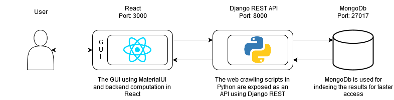

# SmartCart

In simple words - “It is a price comparison website for grocery items”. We extract real-time data from websites of supermarket stores to help users find
the best deal. The features of our product are as follows:

### Sort by Store

This feature provides the user with the store in which they can find all the
items in their grocery list for the lowest cumulative price. Priority is given
to stores that have all the items that the user needs. If a store does not have
a particular item in the grocery list, it gets a lower priority in the sorting
algorithm. We are targeting the customers who want to visit only one store
to get all the items, and we are providing them with the best store.

### Sort by Item

This feature provides the store in which a user can find a particular item for
the lowest price. The sorting is done for each product on the grocery list.
This feature targets those customers who want each product for the cheapest
price, and do not mind visiting multiple stores.

### Customizable Selection

Our product is user-centric, we provide the user with an option to customize
the result. If the user is not happy with the results for a certain item, we
provide them with the option to remove that result and then update the
sorting order instantly. The user can select the items which they prefer and
remove the unwanted items, all while preserving the correctness of the Sort
by Store and Sort by Item features.

### Best Deals

The result of all the features that we provide is that users get the best deals
for their grocery list. Our web application helps all kinds of users to optimize
their shopping experience and customize their preferences.

## Architecture

Logo: 

1. User makes a list of grocery items on the GUI.

2. For each item a call is made using the Axios library to the Django
REST API on a specific port (8000) and route (/findprice)

3. The call sends each item as a JSON request to the Django REST API

4. The Django API is running a Python script on the port.

5. The script accepts the JSON request and checks if the item is indexed
in MongoDb running on certain port (27017)

6. If the item is indexed, it simply returns the result to the React framework.
If it is not present, it invokes the crawling script for the four
websites and then returns the results to the React framework in the
form of a JSON response.

7. Once the React framework has the result it arranges the information
on the GUI in a specific format.

8. When the Sort by Store and Sort by Item functionality is used, functions
are called in the React framework which manipulate the order of
display based on the selection.